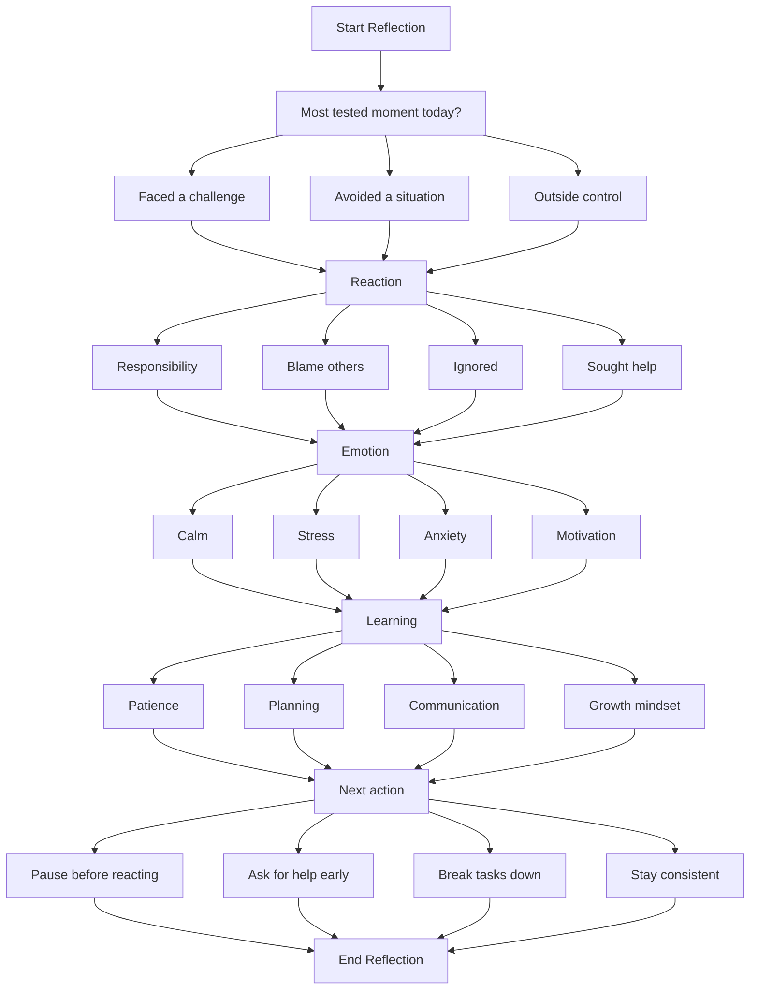

# Reflection Tree

```mermaid
flowchart TD

START[Start Reflection]

START --> Q1[Most tested moment today?]

Q1 --> A1[Faced a challenge]
Q1 --> A2[Avoided a situation]
Q1 --> A3[Outside control]

A1 --> Q2
A2 --> Q2
A3 --> Q2

Q2[Reaction]

Q2 --> B1[Responsibility]
Q2 --> B2[Blame others]
Q2 --> B3[Ignored]
Q2 --> B4[Sought help]

B1 --> Q3
B2 --> Q3
B3 --> Q3
B4 --> Q3

Q3[Emotion]

Q3 --> C1[Calm]
Q3 --> C2[Stress]
Q3 --> C3[Anxiety]
Q3 --> C4[Motivation]

C1 --> Q4
C2 --> Q4
C3 --> Q4
C4 --> Q4

Q4[Learning]

Q4 --> D1[Patience]
Q4 --> D2[Planning]
Q4 --> D3[Communication]
Q4 --> D4[Growth mindset]

D1 --> Q5
D2 --> Q5
D3 --> Q5
D4 --> Q5

Q5[Next action]

Q5 --> E1[Pause before reacting]
Q5 --> E2[Ask for help early]
Q5 --> E3[Break tasks down]
Q5 --> E4[Stay consistent]

E1 --> END
E2 --> END
E3 --> END
E4 --> END

END[End Reflection]
```
